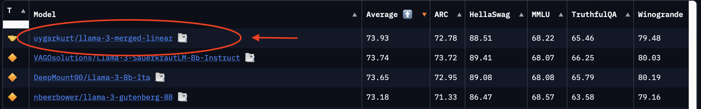

# LLM Model Merging

  

This repository contains the notebook and sample `yml` file for linear model mergind.

In this specific case, I typed `llama-3` into the open LLM leaderboard, took the best 3 models, merged them and created
a better ranking model wihtout any training.

As the main libraries we will be using [mergekit](https://github.com/arcee-ai/mergekit).
